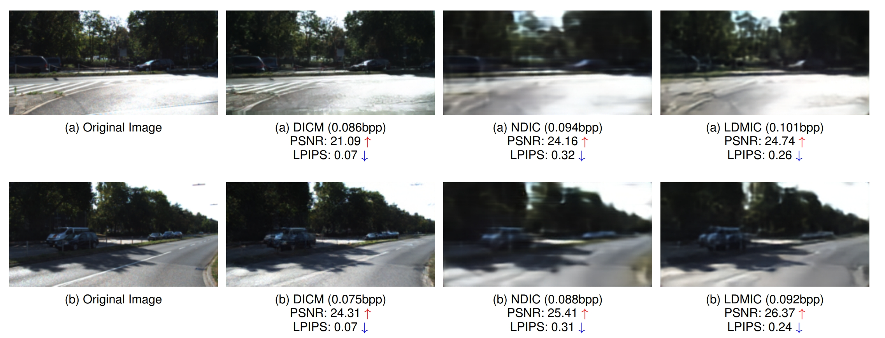
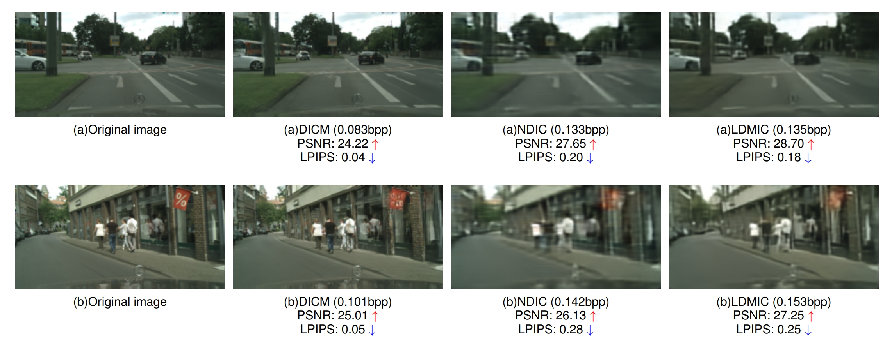
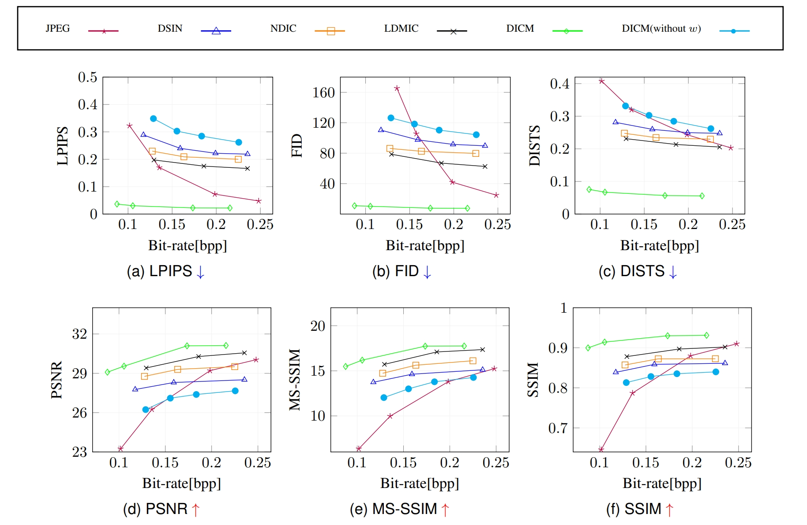

# Distributed Image Compression with Conditional Diffusion Models


 

## Abstract
Distributed image compression explores the inherent correlation to remove redundancy between multi-view images, which has been considered a feasible solution to achieve a higher compression performance in distributed scenarios. Recently, various distributed image compression methods have been developed. However, due to the limited capability of the modeling data probability distributions, these methods result in blurry artifacts in image structures. In this work, we propose the distributed image coding method (DICM) that is the first to introduce a conditional diffusion generation model in the field of distributed image compression, using the image information decoded from the latent space along with side information as conditions to guide the denoising process of the diffusion model. Additionally, to ensure that the reconstructed images align with human visual perception, we optimize the model's noise prediction performance according to perceptual metrics. Experimental results show that DICM outperforms the state-of-the-art distributed compression methods in terms of DISTS scores and achieves comparable performance to VAE-based distributed compression methods on other distortion metrics.

## Requirements
`Python 3.9` is recommended.

Install the required packages with:
```bash
pip install -r requirements.txt
```

### Dataset
The datasets used for experiments are KITTI Stereo and Cityscape.

For KITTI Stereo you can download the necessary image pairs from [KITTI 2012](http://www.cvlibs.net/download.php?file=data_stereo_flow_multiview.zip) and [KITTI 2015](http://www.cvlibs.net/download.php?file=data_scene_flow_multiview.zip). After obtaining `data_stereo_flow_multiview.zip` and `data_scene_flow_multiview.zip`, run the following commands:
```bash
unzip data_stereo_flow_multiview.zip # KITTI 2012
mkdir data_stereo_flow_multiview
mv training data_stereo_flow_multiview
mv testing data_stereo_flow_multiview

unzip data_scene_flow_multiview.zip # KITTI 2015
mkdir data_scene_flow_multiview
mv training data_scene_flow_multiview
mv testing data_scene_flow_multiview
```

For Cityscape you can download the image pairs from [here](https://www.cityscapes-dataset.com/downloads/). After downloading `leftImg8bit_trainvaltest.zip` and `rightImg8bit_trainvaltest.zip`, run the following commands:
```bash
mkdir cityscape_dataset
unzip leftImg8bit_trainvaltest.zip
mv leftImg8bit cityscape_dataset
unzip rightImg8bit_trainvaltest.zip
mv rightImg8bit cityscape_dataset
```
## Getting Started

Our code utilizes the Accelerate library to simplify multi-card execution. To use the code, follow the steps below:

```bash
accelerate launch train.py
```
## Results
 
RD performance comparison of various models trained on the Cityscapes dataset:(a)LPIPS; (b)FID; (c)DISTS;(d)PSNR; (e)MS-SSIM; (f)SSIM. The downward arrow and the upward arrow respectively indicate that the smaller the value, the better the reconstruction effect, and the larger the value, the better the reconstruction effect, respectively.

## Acknowledgment
Our work is inspired by and implemented based on the following projects. We deeply appreciate their outstanding open-source contributions:
- [CDC_compression](https://github.com/buggyyang/CDC_compression)
- [NDIC](https://github.com/ipc-lab/NDIC)

